# Project Overview (Unknown Language Translation to English)

- 1️⃣ New words Tokenization: https://www.kaggle.com/code/shiblinomani/bangla-english-tokenization
- 2️⃣ Datasets
- 3️⃣ Custom Model Training Code: https://www.kaggle.com/code/shiblinomani/unknown-language-translation-in-english
- 4️⃣ Github/github:https://github.com/Shibli-Nomani/Ban2Eng-Unknown-Language-translator-with-T5-transformer-customization
- 5️⃣ Workflow:

```mermaid
    flowchart TD
    A[📝 Text Generation <br> Grok, ChatGPT, Gemeni] --> B[✂️ Sentence Tokenization<br>of Mixed Bangla-English for .vocab]
    B --> C[🤖 Choose Model: T5 Transformer<br>Unknown of Bangla Language]
    C --> |Config, Adding Layers| D[🛠️ T5 Model Customization]
    D --> E[➕ Add New Vocab into Model Vocabulary]
    E --> F[🧹 Data Preprocessing & Tokenization]
    F --> G[🏋️ Model Training]
    G --> H[📊 Model Evaluation:<br>BLEU, Log Likelihood,<br>Perplexity, ROUGE]

    
    style A fill:#f7c6c7,stroke:#000,stroke-width:2px,color:#000
    style B fill:#fceabb,stroke:#000,stroke-width:2px,color:#000
    style C fill:#c6e0f5,stroke:#000,stroke-width:2px,color:#000
    style D fill:#d5f5e3,stroke:#000,stroke-width:2px,color:#000
    style E fill:#f9d5e5,stroke:#000,stroke-width:2px,color:#000
    style F fill:#ffe5b4,stroke:#000,stroke-width:2px,color:#000
    style G fill:#d1c4e9,stroke:#000,stroke-width:2px,color:#000
    style H fill:#a2d5f2,stroke:#000,stroke-width:2px,color:#000

```

### T5-Small (~60M)

```mermaid
graph LR
    A1["T5ForConditionalGeneration<br>~60M<br>parameters"] --> 
    B1["Shared Embedding<br>32128×512<br>≈ 16.4M"] --> 
    C1["Encoder 6 layers<br>total ≈ 19.2M"] --> 
    C1a["Each Encoder Block<br>≈ 3.2M<br>- Self-Attention ≈ 1.05M<br>- Feed Forward ≈ 2.1M"] --> 
    D1["Decoder 6 layers<br>total ≈ 25.2M"] --> 
    D1a["Each Decoder Block<br>≈ 4.2M<br>- Self-Attention ≈ 1.05M<br>- Cross-Attention ≈ 1.05M<br>- Feed Forward ≈ 2.1M"] --> 
    E1["LM Head<br>512→32128<br>≈ 16.4M"]

style A1 fill:#dce6f9,stroke:#333,stroke-width:2px,color:#000,font-size:20px
style B1 fill:#e8dcf9,stroke:#333,stroke-width:2px,color:#000,font-size:20px
style C1 fill:#f9dce6,stroke:#333,stroke-width:2px,color:#000,font-size:20px
style C1a fill:#f9e9dc,stroke:#333,stroke-width:2px,color:#000,font-size:20px
style D1 fill:#dcf9e9,stroke:#333,stroke-width:2px,color:#000,font-size:20px
style D1a fill:#dceff9,stroke:#333,stroke-width:2px,color:#000,font-size:20px
style E1 fill:#f9e9dc,stroke:#333,stroke-width:2px,color:#000,font-size:20px

```

### Customized Model (~92.7M)

```mermaid
graph LR
    A2["T5ForConditionalGeneration<br>~92.7M<br>parameters"] --> 
    B2["Shared Embedding<br>37780×512<br>≈ 19.3M"] --> 
    C2["Encoder 7 layers + LoRA + Adapters<br>≈ 22.6M"] --> 
    C2a["Each Encoder Block<br>≈ 3.23M<br>- Self-Attention ≈ 1.07M<br>- LoRA + Feed Forward + Adapter ≈ 2.16M"] --> 
    D2["Decoder 7 layers + Adaptive Attention<br>≈ 31.5M"] --> 
    D2a["Each Decoder Block<br>≈ 4.5M<br>- Self-Attention ≈ 1.07M<br>- Cross-Attention ≈ 1.07M<br>- Feed Forward ≈ 2.1M<br>- Adaptive Gate ≈ 0.26M"] --> 
    E2["LM Head<br>512→37780<br>≈ 19.3M"]

   style A2 fill:#a3b2e6,stroke:#333,stroke-width:2px,color:#000,font-size:20px
    style B2 fill:#c3a3e6,stroke:#333,stroke-width:2px,color:#000,font-size:20px
    style C2 fill:#e6a3c0,stroke:#333,stroke-width:2px,color:#000,font-size:20px
    style C2a fill:#e6c4a3,stroke:#333,stroke-width:2px,color:#000,font-size:20px
    style D2 fill:#a3e6c4,stroke:#333,stroke-width:2px,color:#000,font-size:20px
    style D2a fill:#a3d4e6,stroke:#333,stroke-width:2px,color:#000,font-size:20px
    style E2 fill:#e6d3a3,stroke:#333,stroke-width:2px,color:#000,font-size:20px

```

| 🔹 Term        | Definition                                                                 |
|----------------|---------------------------------------------------------------------------|
| **LLM**        | AI model trained on massive text data to understand, generate, and translate human-like language. |
| **Transformer**| Neural architecture using self-attention to model sequences efficiently; backbone of modern LLMs. |
| **T5 Small**   | Lightweight Transformer-based Seq2Seq model for text tasks; pretrained on English, limited resources. |

### 🚀 Seq2Seq T5 Model – Purposeful Challenges & Customization

1. **📂 Data Preparation**  
   - Generated **Train, Test, Val** separately from Grok, ChatGPT, Gemini.  
   - Three categories:  
     1️⃣ Mixed Bangla-English in English  
     2️⃣ Pure Bangla in Bangla words  
     3️⃣ Mixed Bangla-English (English in English Letter and Bangla in Bangla Letter)  
   - **Limited dataset**, no external Bangla text included.  
   - **🎯 Target column**: English translation – purpose: teach the new language to translate into English.

2. **⚙️ Model Selection**  
   - **T5 Small** chosen for resource constraints.  
   - Model is **unaware of Bangla**.  

3. **📝 Vocabulary & Tokenization**  
   - Extract vocab only from **generated Train & Val data**.  
   - Combine **T5 English tokens + new Bangla tokens**.  
   - Use **SentencePiece** for uniform tokenization.  

4. **🔧 T5 Configuration Changes**  
   - Increase **dropout & attention_dropout** for stability.  
   - Add **extra encoder & decoder layers** for capacity.  
   - Freeze base layers to preserve English knowledge.  

5. **🧩 Custom Layers / Blocks**  
   - **Adapter Layers**: lightweight residual blocks for parameter-efficient fine-tuning.  
   - **LoRA**: low-rank matrices on Q/K/V to inject Bangla patterns.  
   - **Adaptive Attention**: gating between decoder & encoder states.  

6. **⚡ Optimizer & Scheduler**  
   - Use **Adafactor** with automatic **relative step LR** and **warmup**.  

7. **📊 Performance Evaluation**  
   - **BLEU**: n-gram overlap (translation accuracy)  
   - **ROUGE-L**: longest common subsequence (fluency)  
   - **Perplexity / Log-Likelihood**: model confidence & prediction probability  
   - **Validation monitoring** with early stopping to prevent overfitting.  

# 🛠️ Model Customization

| #   | Component     | Purpose / Role                                     | Importance                                                                                       |
| --- | ------------- | -------------------------------------------------- | ---------------------------------------------------------------------------------------------------------------- |
| 1️⃣ | Embeddings    | Initial layer for input tokens                     | 🛡️ Preserve pretrained embeddings, reduce memory, ensure stability on small dataset                             |
| 2️⃣ | Frozen Layers | Retain pretrained knowledge in lower layers        | ⚡ Maintains generalization, prevents catastrophic forgetting, adapts efficiently to Bangla → English translation |
| 3️⃣ | Encoder       | Maps Bangla/Banglish input → latent semantic space | ✅ Preserve pretrained knowledge, adapt only higher layers to Bangla                                              |
| 4️⃣ | Decoder       | Converts latent embeddings → English output tokens | 🎯 Learn mapping from Bangla latent space → fluent English sequences                                             |
| 5️⃣ | LM Head       | Generates final logits for output tokens           | ✍️ Required to produce correct English words corresponding to latent representation                              |

### Model config (after your edits)
| Setting                      | Value                              | Purpose (plain English)                                  |
|-----------------------------|------------------------------------|-----------------------------------------------------------|
| Base model                  | t5-small                           | Start from strong pretrained weights                      |
| Encoder layers              | 7 (6 + 1 extra)                    | Extra capacity to learn Bangla nuances                    |
| Decoder layers              | 7 (6 + 1 extra)                    | Extra capacity for fluent, faithful English generation    |
| dropout_rate                | 0.3 (↑ from 0.1)                   | Reduce overfitting; make representations more robust      |
| attention_dropout_rate      | 0.3 (↑ from 0.1)                   | Regularize attention; prevent head over-reliance          |
| layerdrop                   | 0.2                                | Randomly drop layers during training → better generalization |
| Relative attention bias     | First block only (unchanged)       | Stable positional inductive bias                          |
| Extra blocks’ rel. bias     | `has_relative_attention_bias=False`| Keep bias placement consistent with T5 design             |

### Training plan (what to freeze vs train)
| Part                       | Trainable? | Purpose (why this choice)                                       |
|---------------------------|------------|------------------------------------------------------------------|
| `model.shared` embedding  | ❌ Frozen   | Keep core token meanings stable across Bangla/English            |
| Encoder layers 0–2        | ❌ Frozen   | Preserve general syntax/semantics from pretraining               |
| Encoder layers 3–7        | ✅ Train    | Adapt higher layers to Bangla grammar & context                  |
| Decoder layers 0–7       | ✅ Train    | Produce fluent, accurate English aligned to Bangla input         |
| LM head (output layer)    | ✅ Train    | Map decoder states → target vocabulary effectively                |

> Notes: layer indices are 0-based. With your added blocks, there are **7 encoder** and **7 decoder** layers total.

## 🚀 Updating the Encoder Layers

| #  | Module / Concept               | Key Idea / Iconography                                                   | Chosen Value & Reasoning |
|----|--------------------------------|-------------------------------------------------------------------------|-------------------------|
| 1️⃣ | Adapter                        | 🔧 Bottleneck FFN layer; down → ReLU → up; residual connection; lightweight extra brain; preserves pretrained knowledge | `bottleneck = 64` → reduces dimensionality for efficiency, preserves key FFN features, adds residual for stability |
| 2️⃣ | LoRA: Preserve Knowledge       | 🧠 Base model frozen; 🪄 LoRA trains small matrices; 🛡️ avoids forgetting | `r = 8` → low-rank; balances trainable parameters and learning capacity |
| 3️⃣ | LoRA: Efficient Adaptation     | ⚡ Small dataset; 📉 less compute; 📝 captures new vocab & grammar       | Uses low-rank adapters → efficient adaptation without full fine-tuning |
| 4️⃣ | LoRA: Task & Language Specific | 🎯 Target key layers (Q/K/V); 💡 efficient adaptation                   | Focus on attention matrices → most impact for cross-lingual transfer |
| 5️⃣ | LoRA: Swap / Combine Languages | 🔄 Multiple adapters; 🌏 load per language; 🏗️ base model unchanged     | Separate adapters per language → modular and flexible multilingual support |
| 💡 | LoRA Analogy                   | 📘 Base = polyglot student; LoRA = Bangla phrasebook, lightweight & safe| Analogy clarifies purpose and efficiency |
| 6️⃣ | LoRA Integration               | 🏗️ LoRA added to q/k/v in all encoder blocks; Adapter added from block 2 onwards; efficiently adapts model without full fine-tuning | Combines Adapter + LoRA → minimal trainable parameters, maximal adaptation |

## 🚀 Add Adaptive Attention in Decoder Sections

| #  | Module / Concept           | Key Idea / Iconography                                                   | Chosen Value & Reasoning |
|----|----------------------------|-------------------------------------------------------------------------|-------------------------|
| 1️⃣ | Adaptive Attention + Gating | 🎯 Gate network adaptively combines encoder & decoder states; ⚡ context scaled by learnable parameter; 🔑 improves cross-attention focus | `hidden_size = 512` → matches T5-small decoder; `scale = ones(hidden_size)` → learnable scaling preserves magnitude; gate = linear(hidden_size, hidden_size) for per-dim adaptive weighting |
| 2️⃣ | Integration into Decoder   | 🏗️ Added after FFN / layer[1] in each decoder block; replaces static cross-attention output with gated adaptive output | Ensures decoder effectively balances source context & own hidden states; improves translation accuracy without modifying base attention |

# 🏆 Model Training and Evaluation

| #  | Name / Type                     | Short Code Summary / Purpose                                                                 |
|----|---------------------------------|---------------------------------------------------------------------------------------------|
| 1️⃣ | `create_optimizer_and_scheduler` | Function: Creates Adafactor optimizer with built-in dynamic LR schedule; no external scheduler needed. |
| 2️⃣ | `Seq2SeqTrainer`                 | Class: Implements custom seq2seq training loop, validation, early stopping, and model saving. |
| 3️⃣ | `__init__`                       | Method: Initializes trainer; sets model, tokenizer, dataloaders, device, optimizer, scaler, epochs, patience, and tracking variables. |
| 4️⃣ | `run_train_epoch`                | Method: Performs one epoch of training; uses mixed precision (`torch.amp`), gradient clipping, and tracks training loss. |
| 5️⃣ | `run_val_epoch`                  | Method: Performs one epoch of validation; computes average loss; tracks total validation time. |
| 6️⃣ | `save_model`                     | Method: Saves model and tokenizer to disk; prints path of saved model. |
| 7️⃣ | `fit`                            | Method: Main training loop; runs train + validation per epoch, applies early stopping, tracks total time. |
| 8️⃣ | `plot_losses`                    | Method: Plots training and validation loss curves for visual inspection of convergence. |
| 9️⃣ | `optimizer = Adafactor(...)`     | Adafactor optimizer: Supports relative step learning rate, warmup, and scaling; used for large-scale seq2seq training. |
| 🔟 | `self.scaler = GradScaler(...)`  | Mixed precision: Scales gradients to prevent underflow in float16 training; only enabled on GPU. |
| 11️⃣ | `torch.nn.utils.clip_grad_norm_` | Clips gradients to max norm (1.0) to stabilize training and prevent exploding gradients. |
| 12️⃣ | `tqdm(self.train_dataloader)`   | Provides progress bar for each training batch with live loss updates. |
| 13️⃣ | `total_val_time`                | Tracks total cumulative validation time across all epochs; used for monitoring efficiency. |

# 🎯 Summary

The original T5 model had no Bangla knowledge. We **added 5,680 new tokens** for mixed Bangla-English input, enabling the model to **start learning Bangla** while retaining English.

Training and validation datasets were prepared separately. **Training loss dropped steadily**, showing effective learning, while **validation loss plateaued** (~2.39–2.46), triggering **early stopping** after 8 patience epochs.

**Key Observations:**  
- 🔹 **Training Loss:** dropped from **0.8820 → 0.7875** over the last few epochs.  
- 🔹 **Validation Loss:** remained **2.39–2.46**, indicating stable but limited generalization.  
- 🔹 **Early Stopping:** triggered after **8 epochs** without improvement, preventing overfitting.

**Justification:**  
- ✅ Training loss drop confirms the model is **learning Bangla tokens**.  
- ⚠️ Validation plateau is expected due to **novel language and dataset size**.  
- 🛡️ Early stopping ensures the model does not overfit. Overall, the model **successfully adapts T5 to Bangla** with custom tokens and mixed-language training.

# 📊 Performance Evaluation

| #  | Name / Type           | Short Code Summary / Purpose                                                                 |
|----|----------------------|---------------------------------------------------------------------------------------------|
| 1️⃣ | `evaluate_model`      | Function: Evaluates a trained model on BLEU, ROUGE-1, ROUGE-L, Perplexity, and Log-Likelihood metrics. |
| 2️⃣ | `model.eval()`        | Puts model in evaluation mode; disables dropout and gradient updates.                      |
| 3️⃣ | `bleu_metric = load("sacrebleu")` | Initializes BLEU metric from `datasets` library for translation quality evaluation.       |
| 4️⃣ | `rouge_metric = load("rouge")`   | Initializes ROUGE metric for summarization/sequence comparison.                           |
| 5️⃣ | Tokenization          | Converts `text_input` and `english_targets` into tensors with padding/truncation for batching. |
| 6️⃣ | Prediction Generation | Uses `model.generate` with `num_beams=4`, `max_length=128` for beam search decoding.       |
| 7️⃣ | Decoding Predictions  | Converts generated token IDs back to text using `tokenizer.batch_decode`.                  |
| 8️⃣ | Perplexity / NLL      | Computes average negative log-likelihood and perplexity per token for model confidence.    |
| 9️⃣ | Metric Computation    | Computes BLEU score, ROUGE scores, log-likelihood, and perplexity from predictions & references. |
| 🔟 | Batching              | Processes data in batches (size=8) for memory efficiency on GPU/CPU.                       |
| 1️⃣ | Return Dictionary    | Returns a dictionary containing: `log_likelihood`, `perplexity`, `bleu`, and `rouge` scores. |

| Metric                  | Value      | Purpose / Why We Use It                                | Interpretation / Justification                                      |
|-------------------------|-----------|-------------------------------------------------------|---------------------------------------------------------------------|
| Log-Likelihood (NLL) 🔥  | -5.2099   | Measures model’s confidence in predicting tokens      | Negative value expected; shows model predicts tokens reasonably, but still uncertain on new Bangla patterns |
| Perplexity 🎯            | 183.08    | Measures prediction uncertainty; lower = better      | High perplexity indicates Bangla is still challenging for T5, due to limited exposure and dataset size |
| BLEU 📊                  | 1.76      | Measures n-gram overlap with reference translation   | Very low BLEU reflects difficulty in exact Bangla-English translation; expected for first adaptation |
| ROUGE-1 📝               | 0.1319    | Measures unigram overlap / content coverage          | Low overlap shows generated text partially matches references; model starting to learn Bangla |
| ROUGE-2 📝               | 0.0208    | Measures bigram overlap / phrase similarity          | Very low score indicates limited phrase-level accuracy; expected with small dataset |
| ROUGE-L / ROUGE-Lsum 📝  | 0.1178 / 0.1183 | Measures longest common subsequence / overall structure | Confirms partial structural learning; model captures some word order but still limited |

# Resulted Output 

### Justification – ROUGE-L & Log-Likelihood

| #   | ROUGE-L Score | Log-Likelihood | Justification |
|-----|---------------|----------------|---------------|
| 0   | 0.1856        | -65.8346       | Moderate overlap with reference; model reasonably predicts festive greeting. |
| 1   | 0.0606        | -120.0762      | Low overlap; birthday sentence structure differs from model output, higher NLL indicates uncertainty. |
| 10  | 0.2535        | -147.5672      | Higher ROUGE-L shows partial correct sequence; negative log-likelihood high due to token errors. |
| 57  | 0.0800        | -115.7060      | Small overlap; model struggles with question structure; NLL indicates prediction uncertainty. |
| 58  | 0.0645        | -173.3233      | Very low overlap; model fails to capture future tense; high NLL reflects poor token probability. |
| 60  | 0.0294        | -119.8803      | Minimal overlap; conversational tone not well captured, moderate NLL. |
| 112 | 0.0968        | -239.6151      | Low overlap for long mixed Bangla-English sentence; very high NLL due to complexity. |
| 114 | 0.0267        | -166.4844      | Almost no overlap; document-related context not learned; high NLL. |
| 118 | 0.1034        | -93.9555       | Slightly better overlap; model partially captures evening query, moderate NLL. |
| 11  | 0.1231        | -80.9562       | Fair ROUGE-L; rickshaw request partially understood, lower NLL reflects simpler tokens. |

## Authors

- [@LinkedIn Khan MD Shibli Nomani](https://www.linkedin.com/in/khan-md-shibli-nomani-45445612b/)